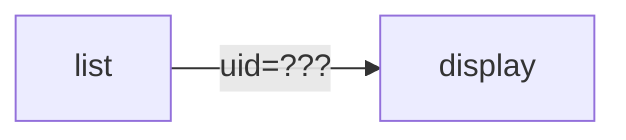

# php_uid_safe

在網頁的連結上，經常使用 GET/POST 方式傳遞參數，這參數極容易被使用者擅自變更，而在有安全考量的情況上，則需要對此進一步加上防範，只接受系統提供的超連結進入，避免使用者更改參數後，看到不被允許的內容。

## 程式說明

list.php 會列出各個項目及超連結，點選後即可 display.php?uid=xxx 進入看單筆的內容。

範例資料夾：
1 .... 沒有加上保護，使用者可以自行修改網址上的 uid
2 .... 加上保護檢查，未被允許的超連結，改 uid 也沒用

# php_uid_safe 功能說明

## 概述
本專案提供 PHP 檔案來安全地管理和顯示用戶數據。

## 文件

### display.php
- 功能：根據用戶的 UID 顯示對應的用戶數據。
- 方法：驗證傳入的 `uid` 和 `chk` 參數，若驗證成功，顯示對應數據；若失敗，顯示錯誤信息。

### list.php
- 功能：顯示一個連結列表，每個連結包含 `uid` 及其對應的驗證碼，連結至 `display.php`。
- 方法：使用 `uid_encode` 函數生成每個 `uid` 的驗證碼，並創建指向 `display.php` 的連結。

## 使用方法
1. 訪問 `list.php` 以獲取 UID 列表。
2. 點擊列表中的任一連結，根據提供的 `uid` 查看相關數據。

## 安全性
- 本專案使用自定義的 `uid_encode` 函數來加強連結的安全性。
